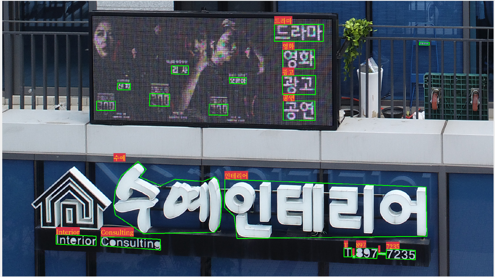
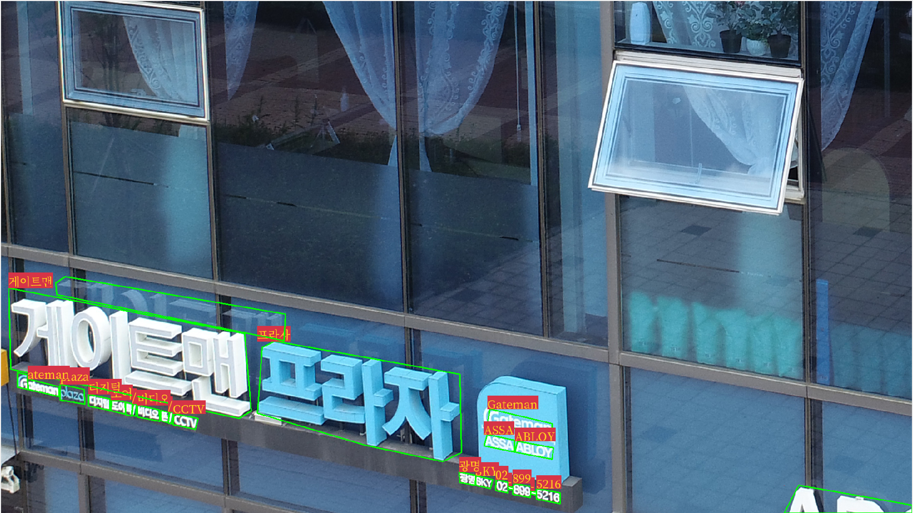
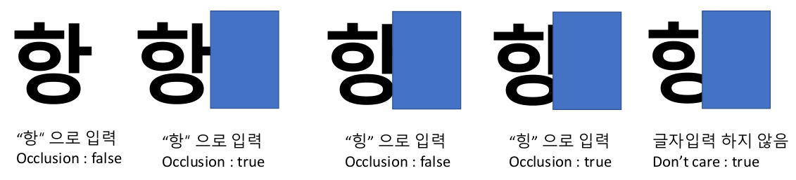
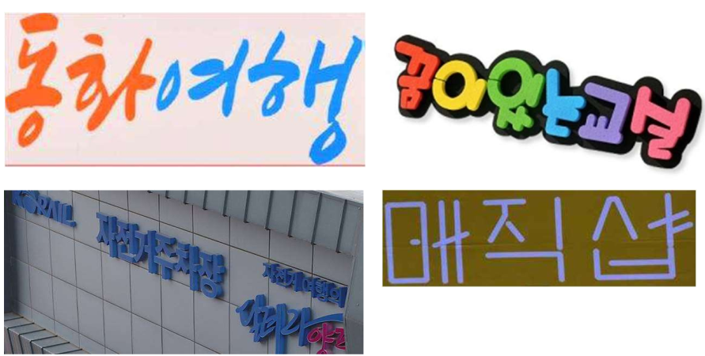
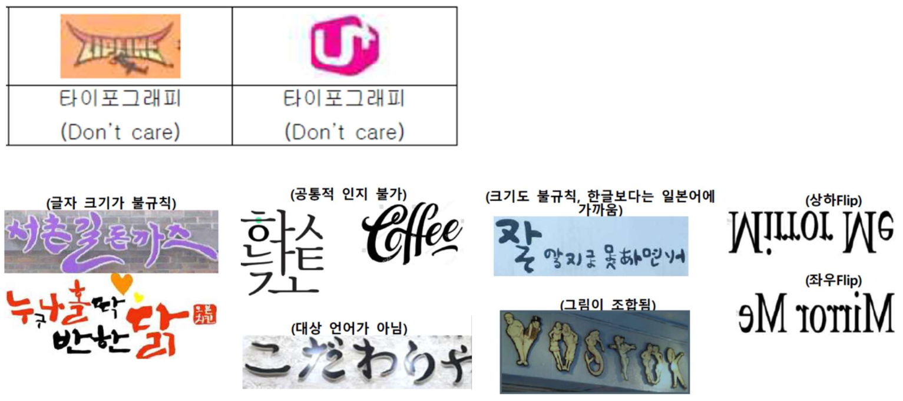

# 문자 인식용 데이터셋

## 1. 구축 목적 및 활용 분야

- 비정형 문자 인식 기술 개발에 대한 관심 증가하고 있음
- 한글 문자 인식용 공개 데이터베이스 부족으로 관련 기술 개발의 어려움 존재
- 일상 생활에서 접할 수 있는 상호, 간판, 도로표지판 등을 포함하는 한글 문자 인식용 데이터를 공개함
- 안전, 교통, 보안, 생활 편의 서비스 등에서 한글 문자 인식 기술을 개발하는데 활용 가능

## 2. 구축 내용

### 데이터 개요

| **항목**   | 내용                                               |
| ---------- | -------------------------------------------------- |
| 해상도     | 1920 x 1080 해상도                                 |
| 데이터     | 이미지 파일(.png)과 어노테이션 파일(.json)         |
| 어노테이션 | 표지판, 상호, 간판 등 한글, 알파벳, 숫자, 특수문자 |
| 수량       | 3,000장                                            |

### 어노테이션 대상 및 방법

#### 대상

- 이미지에서 구분 가능한 '문자열'을 포함하는 '단어'를 태깅함
- '문자열'은 간판, 입체간판, 돌출형 간판, 도로표지판, 등에 명시되어 있는 상점명, 연락처, 부가정보 등을 지칭함
- 단어는 한글, 영어, 숫자 및 특수 문자등으로 구성되어 있음

#### 방법

- 이미지에서 구분 가능한(단축기준 15픽셀 이상) 모든 '문자열'을 찾고 문자열을 구성하고 있는 '의미있는 단어'를 폴리곤으로 태깅
- 동일한 글자 크기로 가로 또는 세로로 일정하게 배치되어 있을 경우 사각형 모양으로 폴리곤 태깅
- 모든 단어는 공백 없이 감싸는 형태로 표시
- 문자열의 속성을 6가지로 구분하여 설정
  - 단어를 구성하는 문자열을 2 개씩 연결했을 때 방향에 따라 reading_direction 속성 설정(horizontal, vertical)
  - 글자의 각도에 따라 8가지 방향으로 분류하여 text_direction 속성 설정
  - 글자의 방향을 특정하기 어려운 경우 가로방향 우선 설정(text_direction = 0)
  - 글자의 키기가 비슷하고 일반적으로 인지 가능한 타이포그래피는 art_character 속성 true로 설정(아닌 경우 false)
  - 글자 획의 일부가 가려져서 인식이 어려운 경우 occlusion 속성 true 설정
  - 한자, 일본어, 러시아어, 거울이나 유리에 반사되어 나타나는 문자, 상하 또는 좌우 뒤집힌 경우 "text_direction"과 "reading_direction" 으로 표현하기 어려운 경우, 등 인지할 수 없는 경우 don't cate 처리함

## 3. 데이터 구조

- 최상위 폴더 하위에 images, json 폴더로 구성되어 있음
- images 폴더에는 하위 폴더에 61개의 하위 폴더로 구성되어 있으며 0601_098 폴더를 제외한 모든 폴더는 50개의 이미지로 구성되어 있음
- json 폴더에는 images 폴더의 하위 폴더와 동일한 개수의 json 파일이 구성되어 있음

### json 파일 구조

```json
{
    // 이미지 하위 폴더 명(json 파일명과 동일)
    "0601_099": {
        "images": [
            {
                // 이미지 아이디
                "id": "00000",
                // 이미지 파일명
                "name": "0601_S01553.jpg",
                "objects": [
                    {
                        // 어노테이션 아이디
                        "id": "00000",
                        // 어노테이션 대상 종류
                        "class": "sign",
                        // 폴리곤 좌표(x1, y1, x2, y2, ..., xn, yn)
                        "points": [
                            "1766.33",
                            "692.10",
                            "1750.90",
                            "953.93",
                            "1305.94",
                            "981.71",
                            "909.33",
                            "992.51",
                            "861.49",
                            "874.20",
                            "883.10",
                            "784.18",
                            "883.61",
                            "749.20",
                            "1051.82",
                            "733.25",
                            "1250.38",
                            "719.36",
                            "1437.11",
                            "713.71",
                            "1601.21",
                            "710.10",
                            "1724.66",
                            "693.64"
                        ],
                        // 특수 문자 여부
                        "Special Characters": "false",
                        // 타이포그래피 여부
                        "Art Characters": "false",
                        // 글자 방향
                        "Text Direction Index": "0",
                        // 문자열 방향
                        "Reading Direction": "Horizontal",
                        "Don't Care": "false",
                        // 글자가림 여부
                        "occlusion": "false",
                        // 글자
                        "Description": "진형식"
                    },
                    ...
                    
```

## 4. 이미지 예제

### 어노테이션 예제 1



### 어노테이션 예제 2



### occlusion 예시



### art character 예시



### Don't care 예시



## 5. 데이터셋 관련 담당자

| 회사명      | 부서명        | 이름   | 전화번호      | 이메일             |
| ----------- | ------------- | ------ | ------------- | ------------------ |
| (주) 엠티콤 | 서비스 기획팀 | 강가람 | 070-4671-0084 | krkang@mtcom.co.kr |

## 6. 알림

본 데이터셋은 2020년도 정부(과학기술정보통신부)의 재원으로 정보통신기획평가원의 지원을 받아 수행된 연구임(No. 2019-0-01766, 인공지능산업원천기술개발 사업)
